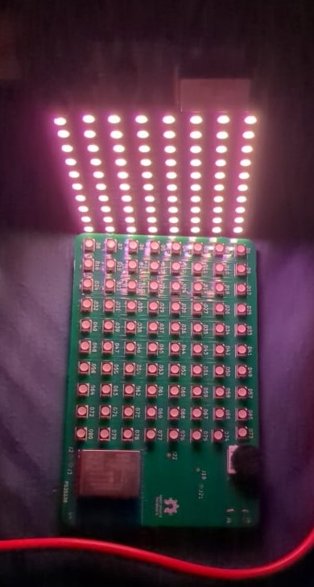
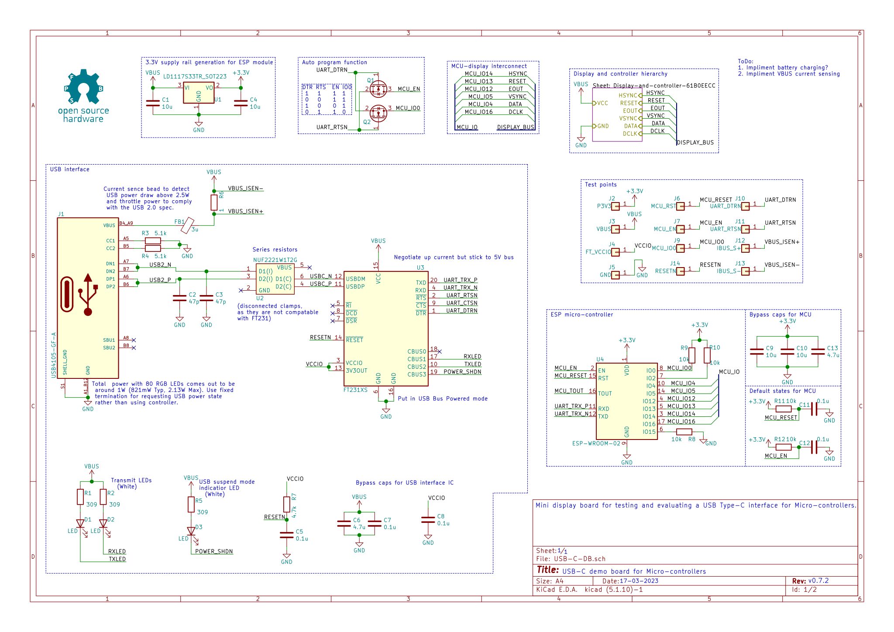
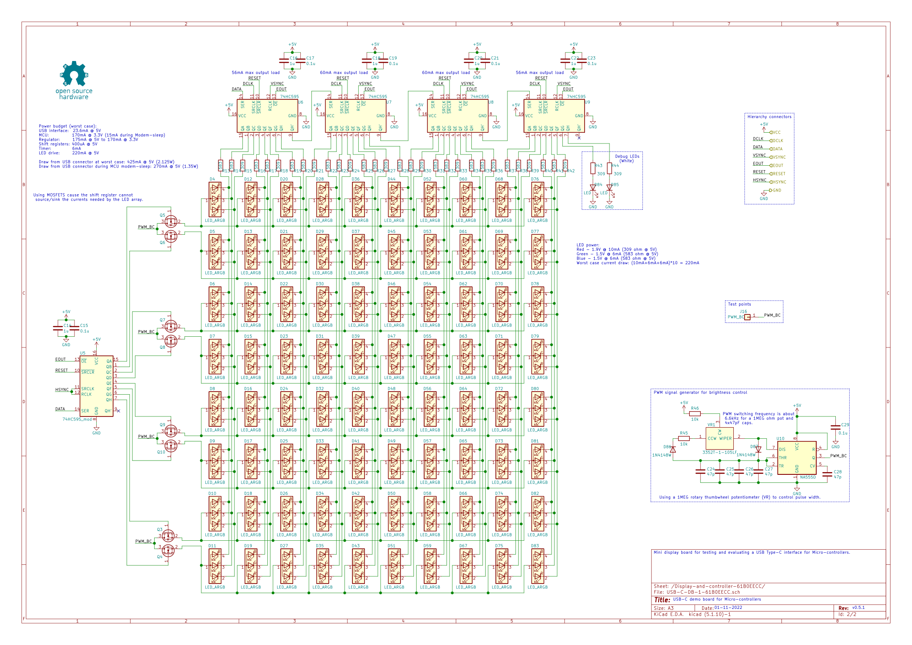

# USB-C display board for Micro-controllers
This is a mini display board with a USB Type-C connector (carrying USB 2.0) and an onboard micro-controller.

The goal of this display board is to test and evaluate:
* The USB-C interface for a Micro-controller
    * This design uses ESP-WROOM-02
* (TENTATIVE) Implementation of an onboard battery to power the board when disconnected from power
* (TENTATIVE) Onboard battery charging capability using USB-C

## Design overview
### Main page

### Display controller hierarchy

## License
The Software and firmware of this project is licensed under the the MIT license and the hardware is under the [Open Source Hardware](https://www.oshwa.org/definition/) license.
