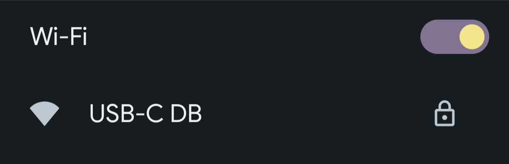
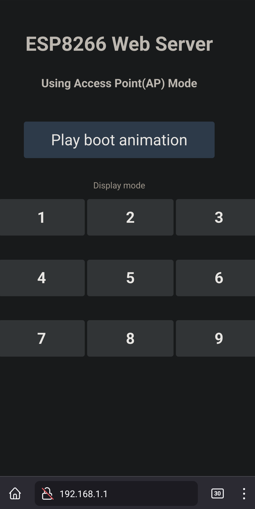

# USB-C display board for Micro-controllers
This is a mini display board with a USB Type-C connector (carrying USB 2.0) and an onboard micro-controller.

The goal of this display board is to test and evaluate:
* The USB-C interface for a Micro-controller
    * This design uses ESP-WROOM-02
* (TENTATIVE) Implementation of an onboard battery to power the board when disconnected from power
* (TENTATIVE) Onboard battery charging capability using USB-C

## Design overview
### Connecting and booting
To connect to the display board, simply connect it to power and connect to the WiFi network `USB-C DB` it hosts.

Once connected navigate to [http://192.168.1.1](http://192.168.1.1/) and click/press `Play boot animation`.

Once the boot animation plays the page will reload with all the functions enabled.

## Power consumption
The USB-C display board consumes anywhere from `450mW` to a maximum of `800mW` depending on the brightness level from 5V USB.
> Note that the display board does not have the capability and will not negotiate to any of the higher voltage levels offered by USB PD

For context a `500mAh` battery will be able to power the display board for about `3.5 hours` (with maximum power level of `800mW`) and about `5.5 hours` (at the lower `450mW` power level).

### Main page

### Display controller hierarchy

## License
The Software and firmware of this project is licensed under the the MIT license and the hardware is under the [Open Source Hardware](https://www.oshwa.org/definition/) license.
