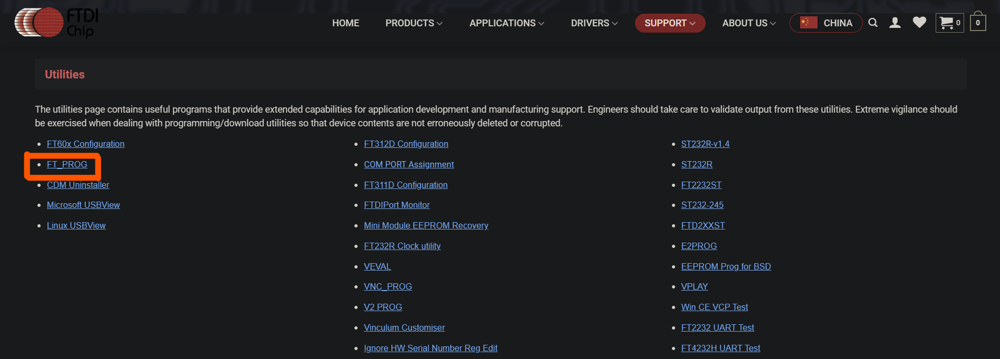
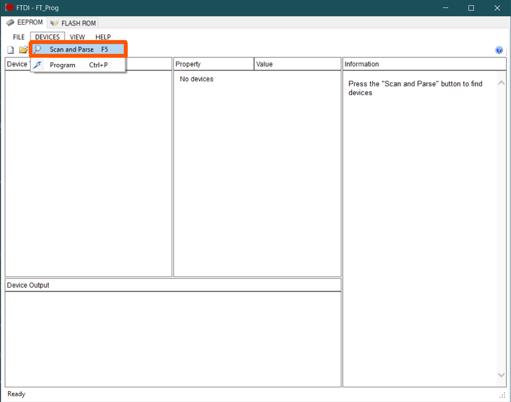
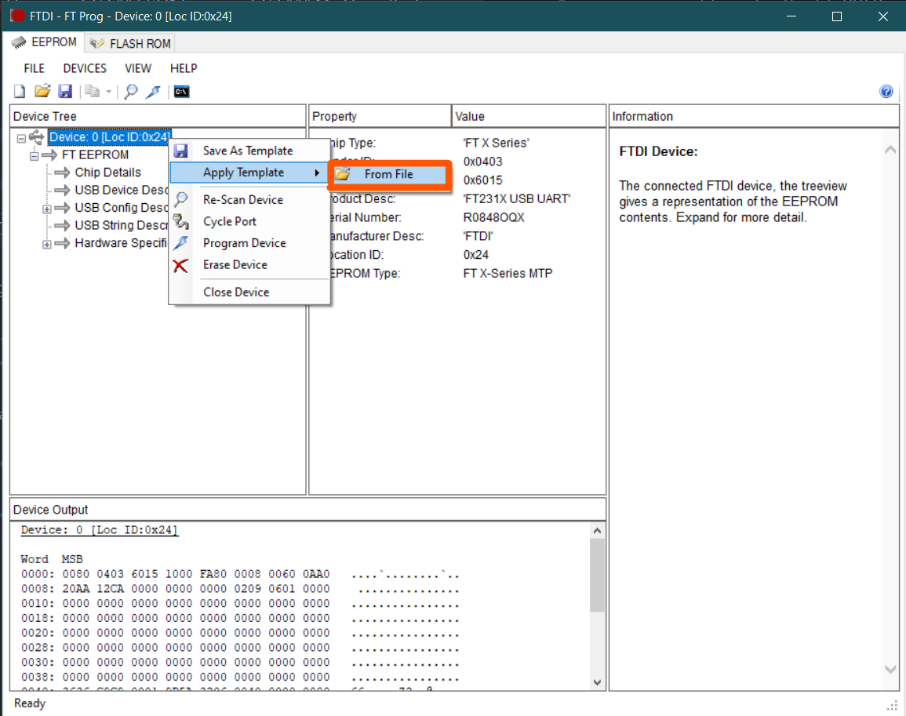
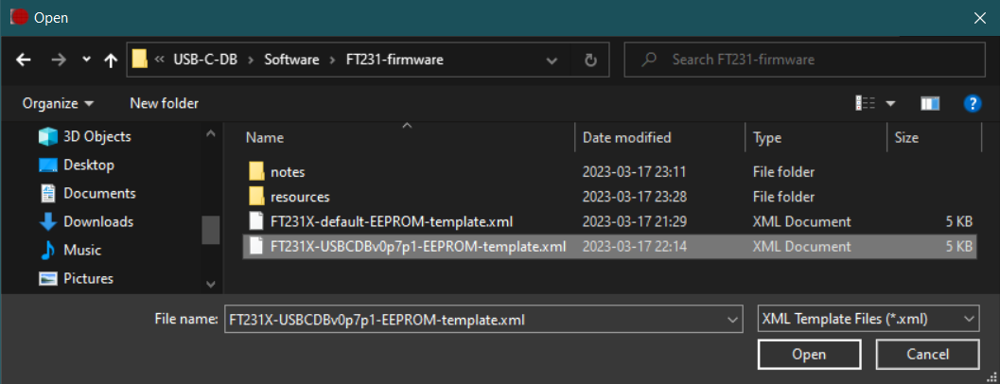
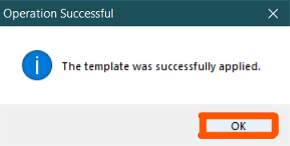
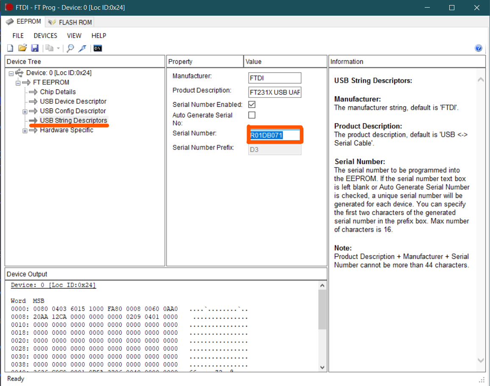
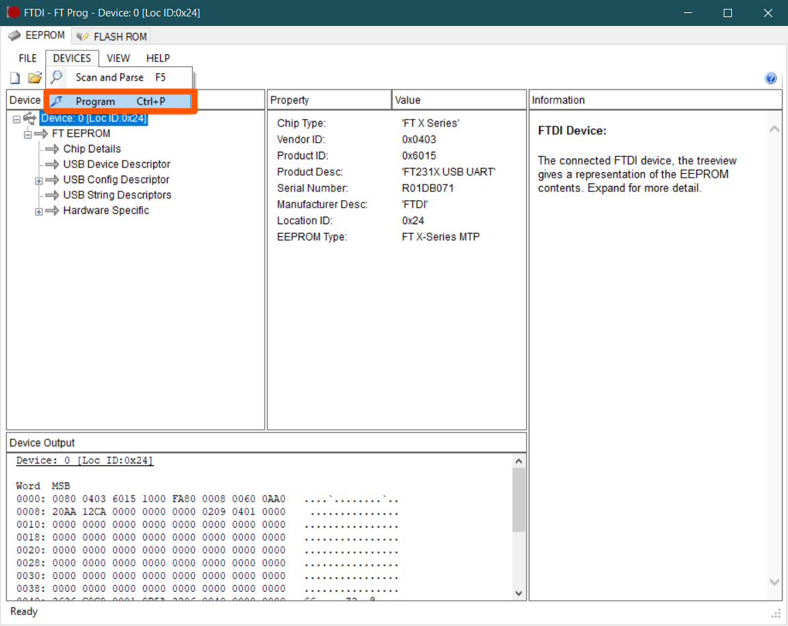
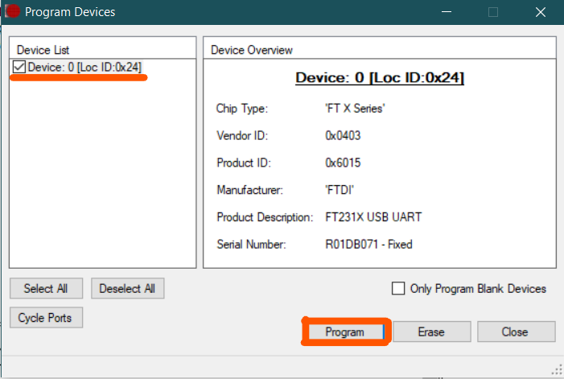
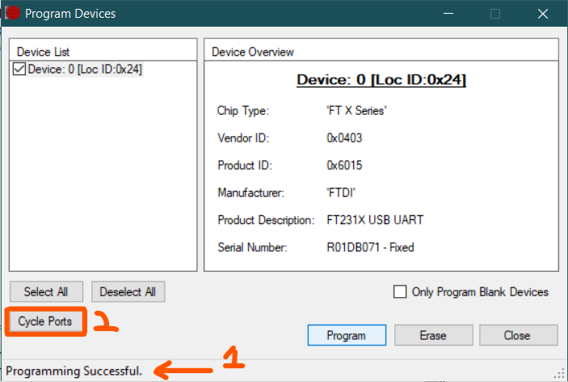

# Read me for the USB-C display board software and firmware
This is a mini display board with a USB Type-C connector (carrying USB 2.0) and an onboard micro-controller.

The goal of this display board is to test and evaluate:
* The USB-C interface for a Micro-controller
    * This design uses ESP-WROOM-02
* (TENTATIVE) Implementation of an onboard battery to power the board when disconnected from power
* (TENTATIVE) Onboard battery charging capability using USB-C

## ESP8266 Firmware
### Demo video
[](https://www.youtube.com/watch?v=l0tGIR3diLk)

### Prerequisites
This firmware is built using [PlatformIO](https://platformio.org/) and uses the `ESP8266` and `Arduino` libraries.

To install and setup [PlatformIO](https://platformio.org/) please visit the [official site](https://platformio.org/install).
> Note that [PlatformIO](https://platformio.org/) is also available for VSCode as an extension! Learn more from [here](https://platformio.org/install/ide?install=vscode).

### Building the firmware
* Open the working directory `Software\firmware` in VSCode or the PlatformIO IDE.
* Run the default build task or the build task for `esp_wroom_02`. The following image is for VSCode.

> Note that the command palette can be opened by going to View>Command Palette...
> 

* Once the build is done the `firmware.bin` and `firmware.elf` files will be available in the `Software\firmware\.pio\build\esp_wroom_02` directory.

### Debugging the firmware
The stack dumps of the firmware can be parsed using the [EspStackTraceDecoder](https://github.com/littleyoda/EspStackTraceDecoder) tool by [littleyoda](https://github.com/littleyoda).
> Note that you may need the `xtensa-lx106-elf-addr2line` binary to run the tool in Windows. This binary can be obtained from [willemwouters](https://github.com/willemwouters)'s [ESP8266](https://github.com/willemwouters/ESP8266) repository [here](https://github.com/willemwouters/ESP8266/tree/master/gcc/xtensa-lx106-elf_c%2B%2B)

## FT231 Firmware
### Prerequisites
To modify the USB serial interface's firmware settings the FT_PROG utility from FTDI. This utility can be obtained from the [utilities page](https://ftdichip.com/utilities/) of FTDI's website.


### Modifying the firmware
1. Connect the display board directly to the system
    > Note that using a dock, dongle or other USB-to-USB connector can cause problems for the FT_PROG utility preventing it from recognizing the board
2. Open the FT_PROG utility and select `Scan and Parse` option from the `DEVICES` menu
    
3. Right click on the listed device and select `Apply Template`, in the submenu select the `From File` option
    
4. Navigate to the `Software/FT231-firmware` directory and select the template XML file and click on `OK` then in the `Operation Successful` window
    
    
5. Expand the `FT EEPROM` section in the `Device Tree` if not already and select `USB String Descriptors`
6. In the middle `Property` column locate the `Serial Number` property and modify its value based on your needs
    
    > Note that it is best to avoid any spaces and special characters in the serial number

    > The format of serial number used by me for all my test boards uses this template `R<board_number>DB<version_number_without_dots>`
7. Once all the required changes have been made click on the `Program` option under the `DEVICES` menu
    
8. In the `Program Devices` window select the device to be programed from the `Device List` column and click on `Program`
    
9. Once programmed the `Programming Successful` message will appear on the bottom left, after which the `Cycle Ports` button can be clicked to disconnect and reconnect the device without physically un-plugging and re-plugging
    
10. Click on `Close` to close the `Program Devices` window, the device can now be re-scanned to confirm the updated firmware

## Frame builder
The USB-C DB frame builder allows exporting of custom frames and frame sequences in a serializable format.

### Prerequisites
This firmware is built using [Python](https://www.python.org), [PyInstaller](https://pyinstaller.org/en/stable/) and [Python Tkinter](https://docs.python.org/3/library/tkinter.html).

The latest version of [Python](https://www.python.org) can be obtained from the [official site](https://www.python.org/downloads/) this version generally comes with [Python Tkinter](https://docs.python.org/3/library/tkinter.html) pre loaded.

To install and setup [PyInstaller](https://pyinstaller.org/en/stable/) please visit the [PyPi.org site](https://pypi.org/project/pyinstaller/).

### Building the frame builder tool
The frame builder tool can be built using 
* Open the working directory `Software\frame-builder` in Windows CMD.
* Run the following command to build the Python code into a runnable executable.
```CMD
pyinstaller.exe frame_builder.py --noconsole
```
> Note that the command `pyinstaller.exe` and the python bin directory needs to be added to the Windows PATH for the command to work. If it is not added the full path of `pyinstaller.exe` will need to be substituted.
* Once the build is done the `firmware.bin` and `firmware.elf` files will be available in the `Software\firmware\.pio\build\esp_wroom_02` directory.

### Building the UI
The framework for the the frame builder GUI is built using the [PAGE](https://page.sourceforge.net/) GUI builder tool for Python and Tkinter.

The latest version of PAGE can be obtained from the [SourceForge site for PAGE](https://sourceforge.net/projects/page/).

## License
The Software and firmware of this project is licensed under the the MIT license and the hardware is under the [Open Source Hardware](https://www.oshwa.org/definition/) license.
