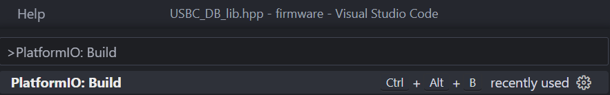
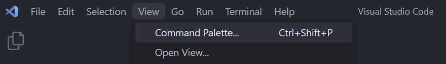

# Read me for the USB-C display board software and firmware
This is a mini display board with a USB Type-C connector (carrying USB 2.0) and an onboard micro-controller.

The goal of this display board is to test and evaluate:
* The USB-C interface for a Micro-controller
    * This design uses ESP-WROOM-02
* (TENTATIVE) Implementation of an onboard battery to power the board when disconnected from power
* (TENTATIVE) Onboard battery charging capability using USB-C

## Firmware
### Demo video

### Prerequisites
This firmware is built using [PlatformIO](https://platformio.org/) and uses the `ESP8266` and `Arduino` libraries.

To install and setup [PlatformIO](https://platformio.org/) please visit the [official site](https://platformio.org/install).
> Note that [PlatformIO](https://platformio.org/) is also available for VSCode as an extension!Learn more from [here](https://platformio.org/install/ide?install=vscode).

### Building the firmware
* Open the working directory `Software\firmware` in VSCode or the PlatformIO IDE.
* Run the the default build task or the build task for `esp_wroom_02`. The following image is for VSCode.

> Note that the command palette can be opened by going to View>Command Palette...
> 

* Once the build is done the `firmware.bin` and `firmware.elf` files will be available in the `Software\firmware\.pio\build\esp_wroom_02` directory.

### Debugging the firmware
The stack dumps of the firmware can be parsed using the [EspStackTraceDecoder](https://github.com/littleyoda/EspStackTraceDecoder) tool by [littleyoda](https://github.com/littleyoda).
> Note that you may need the `xtensa-lx106-elf-addr2line` binary to run the tool in Windows. This binary can be obtained from [willemwouters](https://github.com/willemwouters)'s [ESP8266](https://github.com/willemwouters/ESP8266) repository [here](https://github.com/willemwouters/ESP8266/tree/master/gcc/xtensa-lx106-elf_c%2B%2B)

## License
The Software and firmware of this project is licensed under the the MIT license and the hardware is under the [Open Source Hardware](https://www.oshwa.org/definition/) license.
